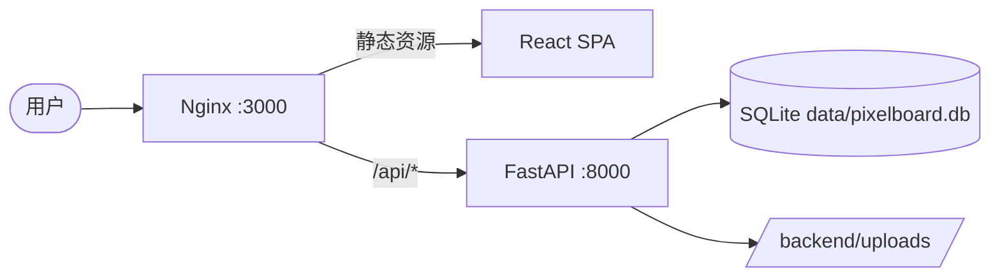
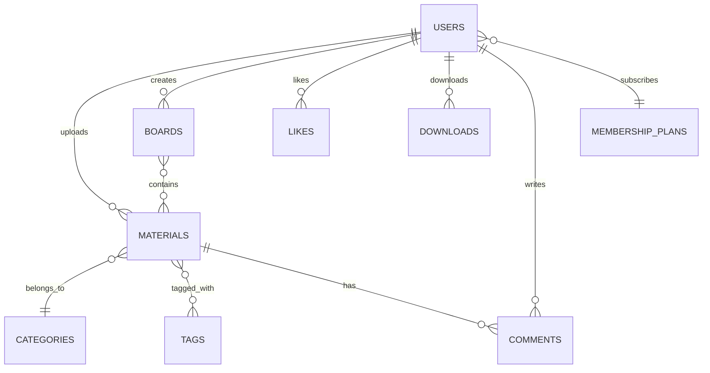

# 🎨 PixelBoard — 灵感素材社区

> **发现、收藏、分享高质量创意素材，激发你的无限灵感。**

PixelBoard 是一个类 Pinterest 的创意素材分享平台，为设计师、摄影师和创作者提供高质量素材的发现、上传、收藏与管理功能，并内置完整的会员订阅体系，支持多层级权益管理。

---

## 🛠 技术栈

| 层级 | 技术 |
|------|------|
| **Frontend** | React 18 + Vite + Tailwind CSS + Zustand + React Router |
| **Backend** | Python FastAPI + SQLAlchemy ORM + Pydantic |
| **Database** | SQLite 默认持久化，也可通过环境变量切换 MySQL |
| **Infra** | 单容器 Dockerfile + Nginx |

---

## 🏗️ 系统架构



### 核心模块

- **认证模块** — JWT Token 鉴权，注册/登录/权限校验
- **素材模块** — 上传/浏览/搜索/点赞/下载/评论
- **画板模块** — 创建画板、收藏素材到画板
- **会员模块** — 免费/专业/尊享三级会员体系，限制下载次数与存储空间
- **管理后台** — 用户管理、素材审核、分类管理、数据看板

---

## 💾 数据库设计



| 配置项 | 值 |
|--------|-----|
| Type | SQLite 默认，兼容 MySQL |
| Path | /app/data/pixelboard.db |
| Env | DATABASE_URL 可覆盖 |
| Charset | utf8 |

---

## 🚀 启动指南 (How to Run)

1. 确保 Docker Desktop 已启动
2. 在交付目录执行：
   ```bash
   docker build -t pixelboard-3124 .
   docker run --rm -p 3000:3000 -p 8000:8000 pixelboard-3124
   ```
3. 访问前端：http://localhost:3000
4. 访问后端 API 文档：http://localhost:8000/docs
5. 健康检查：http://localhost:8000/api/health

---

## 🔗 服务地址 (Services)

| 服务 | 地址 |
|------|------|
| Frontend | http://localhost:3000 |
| Backend Swagger | http://localhost:8000/docs |
| Health Check | http://localhost:8000/api/health |

---

## 🧪 测试账号

| 角色 | 用户名 | 密码 | 说明 |
|------|--------|------|------|
| 管理员 | admin | 123456 | 拥有后台管理权限 |
| 普通用户 | demo | demo123 | 专业会员，已有上传素材 |
| 创作者 | creator | creator123 | 尊享会员 |

---

## 📷 功能介绍

### 用户端

- **首页** — Hero Banner + 分类快捷入口 + 瀑布流素材展示（最新/热门/推荐切换）
- **探索** — 关键词搜索 + 分类筛选 + 标签过滤 + 多维排序（综合推荐/最新上传/最受欢迎/下载最多）
- **素材详情** — 大图预览 + 点赞/收藏/下载 + 评论系统 + 相关推荐
- **上传素材** — 拖拽上传 + 图片预览 + 分类/标签设置 + 会员专享标记
- **个人主页** — 用户信息 + 上传素材 + 画板展示
- **画板** — 创建/管理画板，收藏素材到画板
- **账号设置** — 修改昵称/头像/邮箱/手机号/密码，邮箱手机号带格式校验
- **会员中心** — 三级会员计划对比 + 订阅确认弹窗 + 权益对比锚点定位

### 管理后台

- **仪表盘** — 关键指标统计（用户数、素材数、下载量等）
- **用户管理** — 搜索/筛选 + 角色/状态编辑（管理员不可修改自身角色和状态）
- **素材管理** — 审核/拒绝/删除素材
- **分类管理** — CRUD 分类，有关联素材时阻止删除

### 会员体系

| 权益 | 免费会员 | 专业会员 (¥29/月) | 尊享会员 (¥59/月) |
|------|---------|-------------------|-------------------|
| 每日下载 | 5次 | 50次 | 无限 |
| 上传数量 | 20个 | 500个 | 无限 |
| 原图下载 | — | ✅ | ✅ |
| 存储空间 | 100MB | 5GB | 50GB |
| 优先客服 | — | — | ✅ |

---

## 📁 项目结构

```
label-3124/
├── README.md                    # 项目文档
├── deploy/
│   └── nginx.conf               # 单容器 Nginx 代理配置
├── scripts/
│   └── start.sh                 # 容器启动脚本
├── frontend/                    # React 前端
│   ├── package.json
│   ├── package-lock.json
│   ├── vite.config.js
│   ├── tailwind.config.js
│   └── src/
│       ├── api/index.js         # Axios 实例 + 拦截器
│       ├── store/authStore.js   # Zustand 全局状态
│       ├── utils/validators.js  # 校验与格式化工具
│       ├── components/          # 可复用组件
│       │   ├── Layout.jsx
│       │   ├── Navbar.jsx
│       │   ├── MasonryGrid.jsx
│       │   ├── MaterialCard.jsx
│       │   ├── Modal.jsx
│       │   ├── ErrorBoundary.jsx
│       │   └── ProtectedRoute.jsx
│       └── pages/               # 页面组件
│           ├── Login.jsx
│           ├── Register.jsx
│           ├── Home.jsx
│           ├── Explore.jsx
│           ├── MaterialDetail.jsx
│           ├── Profile.jsx
│           ├── Settings.jsx
│           ├── Upload.jsx
│           ├── Membership.jsx
│           ├── BoardDetail.jsx
│           └── admin/           # 管理后台
├── backend/                     # FastAPI 后端
│   ├── requirements.txt
│   └── app/
│       ├── main.py              # FastAPI 入口 + 中间件
│       ├── config.py            # 配置管理
│       ├── database.py          # 数据库连接 + 重试
│       ├── logger.py            # 结构化日志
│       ├── response.py          # 统一响应格式
│       ├── auth.py              # JWT 认证 + 权限
│       ├── seed.py              # 数据初始化
│       ├── models/models.py     # SQLAlchemy ORM 模型
│       ├── schemas/schemas.py   # Pydantic 校验模型
│       └── routers/             # API 路由
│           ├── auth.py          # 认证接口
│           ├── users.py         # 用户接口
│           ├── materials.py     # 素材接口
│           ├── boards.py        # 画板接口
│           ├── categories.py    # 分类接口
│           ├── membership.py    # 会员接口
│           └── admin.py         # 管理接口
```

---

## 🔧 专业工程实践

### 1. 日志系统
- 使用 Python `logging` 标准库，结构化输出（时间戳 + 级别 + 模块 + 行号）
- 所有关键操作（登录、注册、上传、下载、管理操作）均有日志记录
- 容器标准输出会打印前端、后端文档和健康检查地址

### 2. 错误处理
- **前端**：ErrorBoundary 捕获渲染异常，Axios 拦截器统一处理 HTTP 错误
- **后端**：全局异常处理器 + Pydantic ValidationError 专用处理
- **消息去重**：2秒内相同错误消息不重复弹出
- **业务错误标记**：`_isBusinessError` 防止拦截器重复提示
- **友好提示**：删除有关联数据时返回具体原因而非"系统内部错误"

### 3. 数据校验
- **前端**：表单级校验（用户名/密码/邮箱/手机号），空值可提交、有值则校验
- **后端**：Pydantic V2 模型严格校验，自定义 validator 验证邮箱和手机号格式

### 4. 接口设计
- RESTful API 设计，统一响应格式 `{code, message, data}`
- 分页接口统一返回 `{items, total, page, page_size}`
- JWT Bearer Token 鉴权，支持可选认证（游客可浏览）

### 5. 生产级特性清单

| 维度 | 状态 | 说明 |
|------|------|------|
| 响应式布局 | ✅ | PC + 移动端适配 |
| 数据持久化 | ✅ | SQLite 数据文件和上传目录持久化 |
| 模块化架构 | ✅ | 前后端分离，路由/模型/组件各自独立 |
| ORM | ✅ | SQLAlchemy 管理数据，无原始 SQL |
| 数据初始化 | ✅ | 启动时自动 Seed 演示数据 |
| 中文不乱码 | ✅ | UTF-8 配置 + 全链路中文内容 |
| 密码安全 | ✅ | BCrypt 加密，运行时校正 admin 密码 |
| 角色权限 | ✅ | admin/user 角色区分，路由守卫 |
| 文件上传 | ✅ | 支持拖拽上传，类型/大小校验 |
| 瀑布流布局 | ✅ | Pinterest 风格 Masonry 布局 |
| 订阅确认 | ✅ | 会员订阅二次确认弹窗，防止误操作 |
| 综合排序 | ✅ | 基于点赞/下载/浏览的加权综合推荐算法 |

---

## 🐳 Docker 配置

### 镜像源
- **npm**：使用淘宝镜像 `https://registry.npmmirror.com`
- **pip**：使用阿里云镜像 `https://mirrors.aliyun.com/pypi/simple/`
- **Docker Hub**：使用官方镜像

### 构建优化
- 前端使用 Node 构建后交给 Nginx 提供静态资源
- 后端使用 FastAPI + Uvicorn，默认 SQLite 无需额外数据库服务
- 前端使用 `npm ci` 确保构建确定性

---

## 🔑 关键实现路径

1. **基础架构搭建** → 单容器启动 + SQLite + FastAPI + React
2. **数据模型设计** → 用户/素材/画板/会员/评论等核心实体及关系
3. **认证体系** → JWT 登录注册 + 角色权限 + 路由守卫
4. **核心业务** → 素材上传/浏览/搜索/点赞/下载/收藏
5. **会员体系** → 三级计划 + 下载限制 + 订阅管理
6. **管理后台** → 数据看板 + 用户/素材/分类 CRUD
7. **UI 打磨** → 瀑布流布局 + 响应式 + 交互反馈 + 骨架屏
